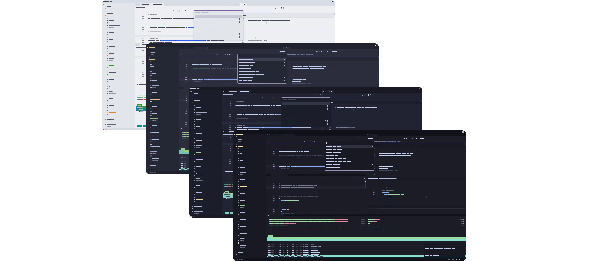
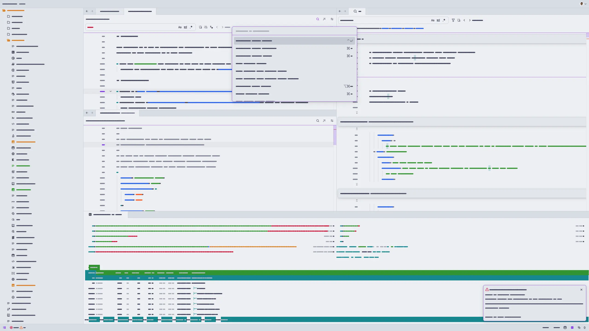
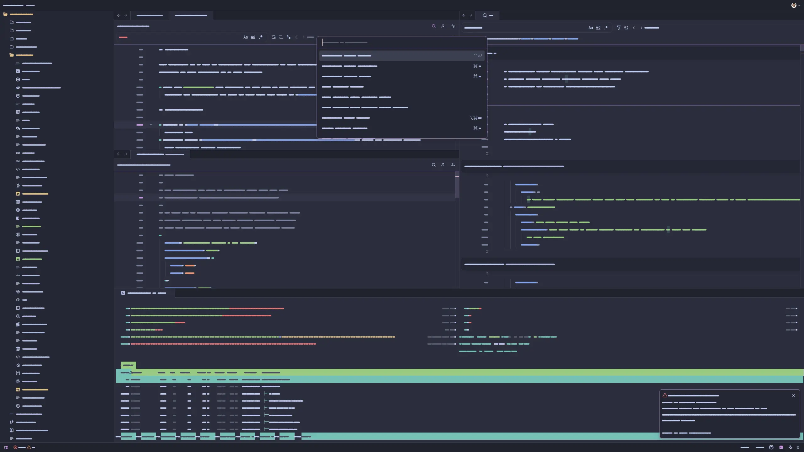
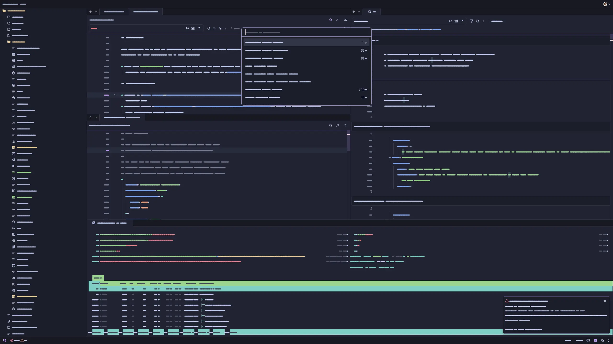
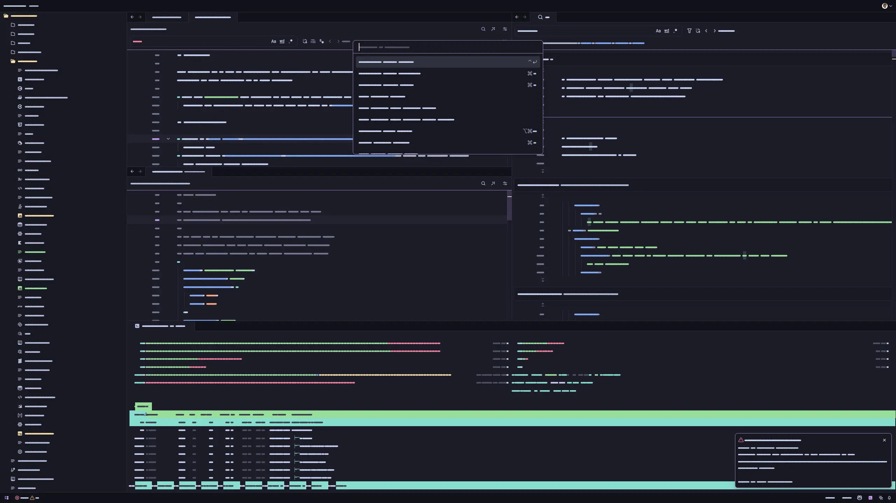

<h3 align="center">
	 
	
	Catppuccin for <a href="https://zed.dev/">Zed</a>
	
</h3>

	
	
	

	

## Previews

🌻 Latte

🪴 Frappé

🌺 Macchiato

🌿 Mocha

## Usage

1. Open Zed.
2. Open the command palette (<kbd>Cmd</kbd>+<kbd>Shift</kbd>+<kbd>P</kbd>) and enter _zed: extensions_.
3. Search for the _Catppuccin_ extension and install.
4. Enter _theme selector: toggle_ in the command palette and select the Catppuccin theme in your preferred flavor in the dropdown.

### Accents

1. Download the JSON file of your preferred accent from the [latest GitHub release](https://github.com/catppuccin/zed/releases/latest).
2. Create the `themes/` subfolder inside the directory of your [Zed configuration file](https://zed.dev/docs/configuring-zed#settings-files) (typically `~/.config/zed/`).
3. Move the downloaded file from Step 1 to the `themes/` subfolder created in Step 2.
4. Restart Zed.
5. Enter _theme selector: toggle_ in the command palette and select your new flavor and accent combination theme in the dropdown.

## Development

Install [Whiskers](https://github.com/catppuccin/whiskers), Catppuccin's in-house theme generator, to build and test themes locally.

Once installed, run `whiskers zed.tera` to generate all themes in the `themes/` directory.

You can then test the themes in Zed by opening the command palette and entering _zed: install dev extension_, selecting this repository, and then refreshing the theme extension using _zed: reload extensions_. _workspace: reload_ may be needed if changes are not reflected immediately. See the [Zed documentation](https://zed.dev/docs/extensions/developing-extensions) for more information.

### Publishing to the Marketplace

See the [Zed documentation](https://zed.dev/docs/extensions/developing-extensions#updating-an-extension) for more information.

## 💝 Thanks to

- [tecandrew](https://github.com/tecandrew)

&nbsp;

	

	Copyright &copy; 2021-present <a href="https://github.com/catppuccin" target="_blank">Catppuccin Org</a>

	

