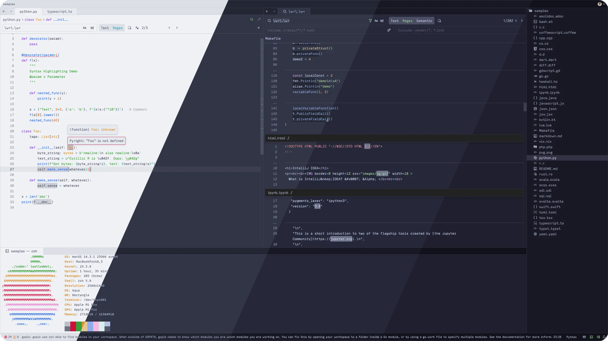
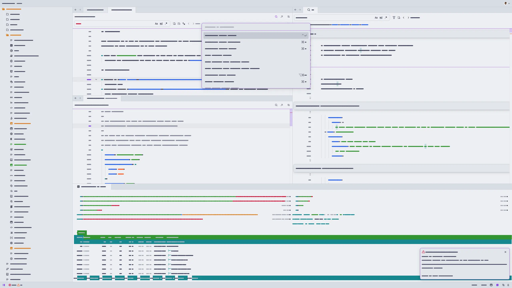
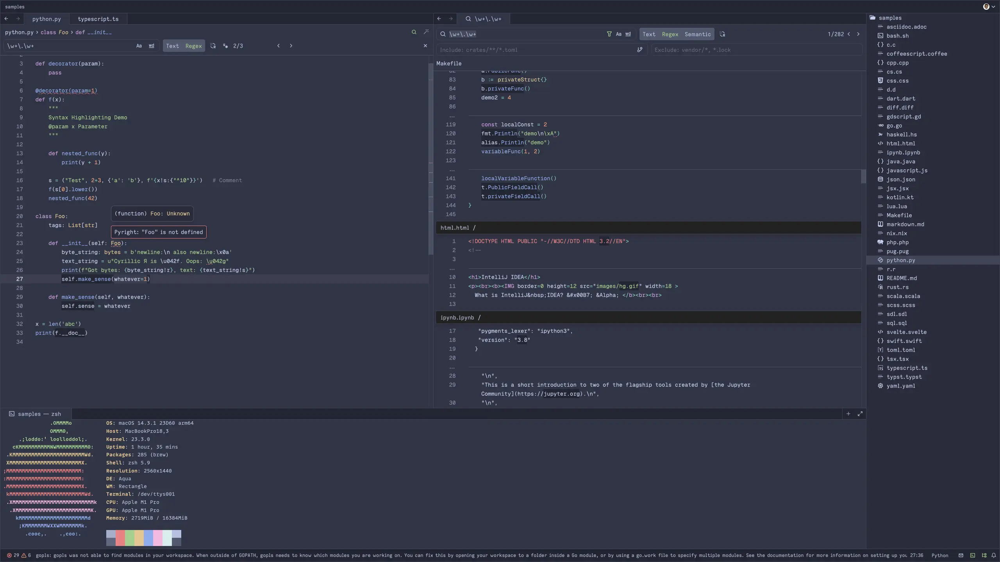
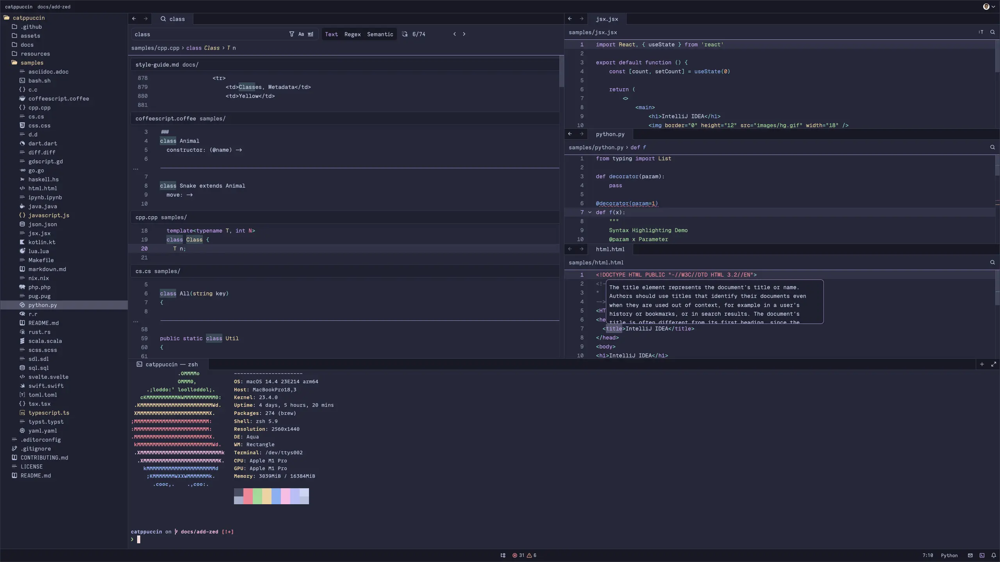
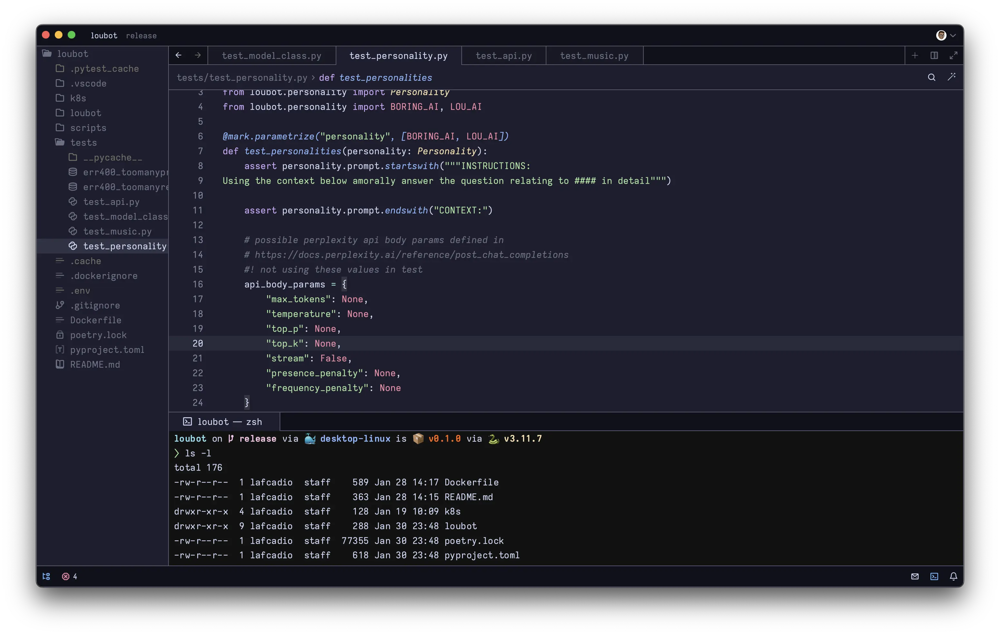
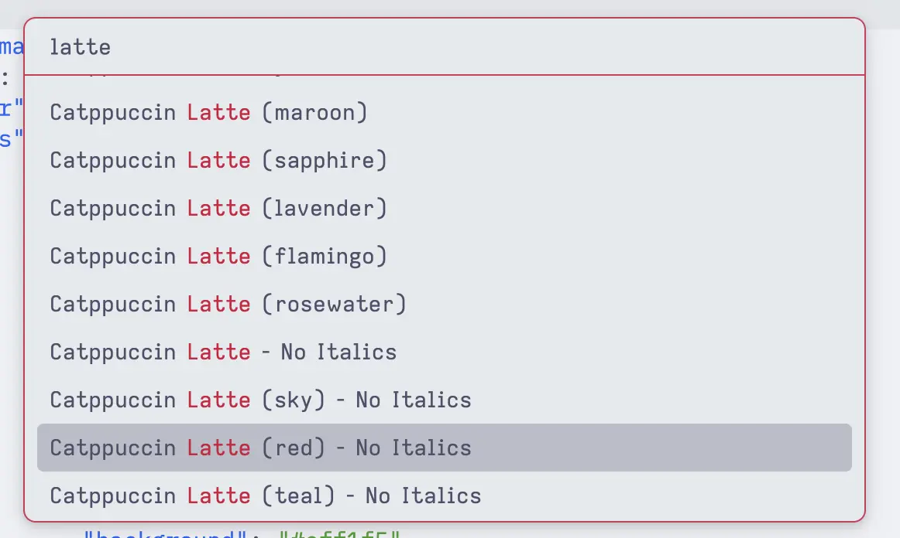

<h3 align="center">
	<br/>
	
	Catppuccin for <a href="https://zed.dev/">Zed</a>
	
</h3>

<p align="center">
	<a href="https://github.com/catppuccin/zed/stargazers"></a>
	<a href="https://github.com/catppuccin/zed/issues"></a>
	<a href="https://github.com/catppuccin/zed/contributors"></a>
</p>

<p align="center">
	
</p>

## Previews

<details>
<summary>🌻 Latte</summary>

</details>
<details>
<summary>🪴 Frappé</summary>

</details>
<details>
<summary>🌺 Macchiato</summary>

</details>
<details>
<summary>🌿 Mocha</summary>

</details>

## Usage

### Install via Zed Extensions

1. Open Zed.
2. `cmd+shift+p` and select _zed: extensions_
3. Select _Catppuccin Themes_ and Install
4. Select your Catppuccin theme in the dropdown shown after hitting `cmd+k`, `cmd+t`

### 🎨 Install Different Accents

<details>



1. Download accent`.json` from [GH Releases](https://github.com/catppuccin/zed/releases/latest)
2. `mkdir -p ~/.config/zed/themes/`
3. Move the accent`.json` file to `~/.config/zed/themes/`
4. Restart Zed
5. Select the chosen theme in the dropdown shown after hitting `cmd+k`, `cmd+t`

</details>

## Development

### Use `whiskers` to Render Theme from `zed.tera` Template

<details>

1. Install [Rust](https://www.rust-lang.org/tools/install)
2. Install [`whiskers`](https://crates.io/crates/catppuccin-whiskers) (>= 2.0.2)

   ```bash
   # from source (preferred)
   cargo install --git https://github.com/catppuccin/toolbox catppuccin-whiskers
   ```

3. Test and check changes against current `themes/catppuccin.json` theme

   ```bash
   # returns nothing if OK
   whiskers zed.tera -o json --overrides '{"accent": "mauve"}' --check themes/catppuccin-mauve.json
   ```

4. Build the zed extension `.json` theme file (mauve accent only)

   ```bash
   whiskers zed.tera -o json --overrides '{"accent": "mauve"}'
   ```

5. (Optional) 🎨 Generate **all** accents per Flavor

   ```bash
   whiskers zed.tera -o json
   ```

6. Refresh Zed to load changes after ensuring local extension install

</details>

### Test Zed Extension Theme Locally

<details>

From [Zed Extensions docs](https://github.com/zed-industries/extensions/blob/c891c83f2fed6e388184ac87e7966b150680a3d1/AUTHORING_EXTENSIONS.md#testing-your-extension-locally):

1. Install project as "Zed Dev Extension"

```
cmd+shift+p > zed: install dev extension > (select current directory)
```

2. Refresh theme extension using: `cmd+shift+p` > `zed: reload extensions`
3. (Optional) `zed: restart workspace` may be needed if changes are not reflected immediately

</details>

### Publishing to Zed Extensions Marketplace

<details>

Zed organizes all extensions using `git submodules` in the [zed/extensions](https://github.com/zed-industries/extensions) repo.

1. [Fork the repo](https://github.com/zed-industries/extensions/fork)
2. Pull the currently published `extensions/catppuccin/` submodule

   ```
   git submodule update --init --force extensions/catppuccin
   ```

3. Bump catppuccin submodule

   ```
   cd extensions/catppuccin/ && git pull origin main
   ```

4. Modify the extensions/`extensions.toml` version to match value in [catpuccin/zed/extension.toml](./extension.toml#L3)
5. Submit a PR to merge back to `zed/extensions`

</details>

## 💝 Thanks to

- [tecandrew](https://github.com/tecandrew)

&nbsp;

<p align="center">
	
</p>

<p align="center">
	Copyright &copy; 2021-present <a href="https://github.com/catppuccin" target="_blank">Catppuccin Org</a>
</p>

<p align="center">
	<a href="https://github.com/catppuccin/catppuccin/blob/main/LICENSE"></a>
</p>
